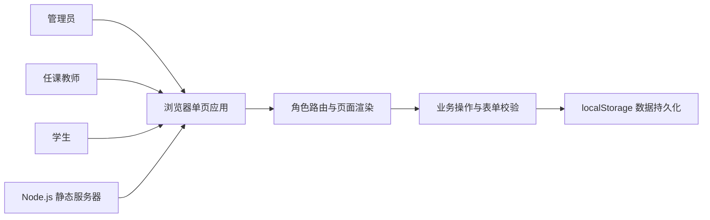
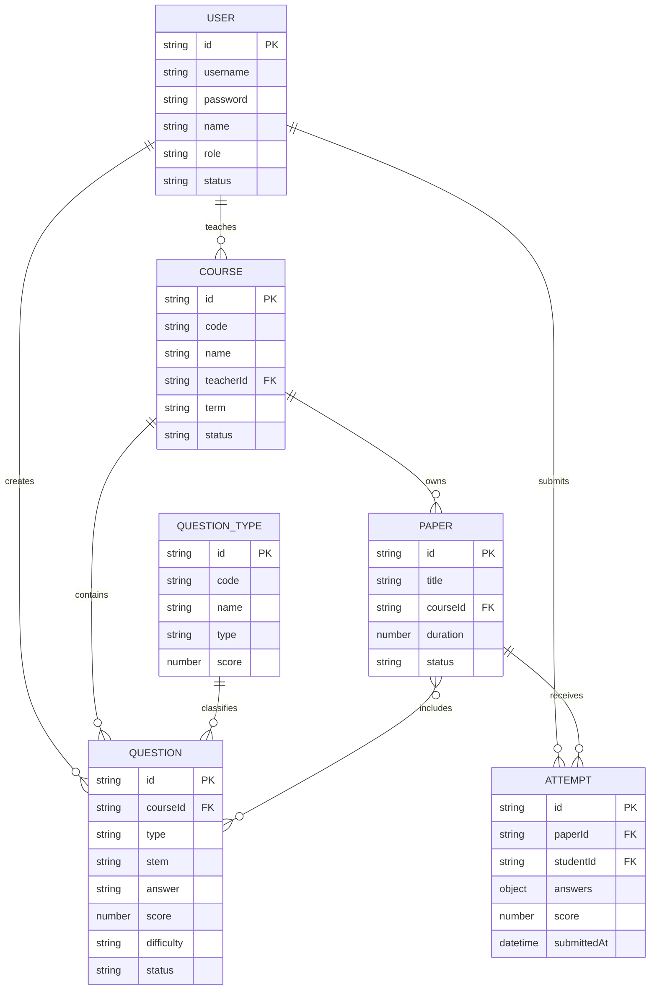
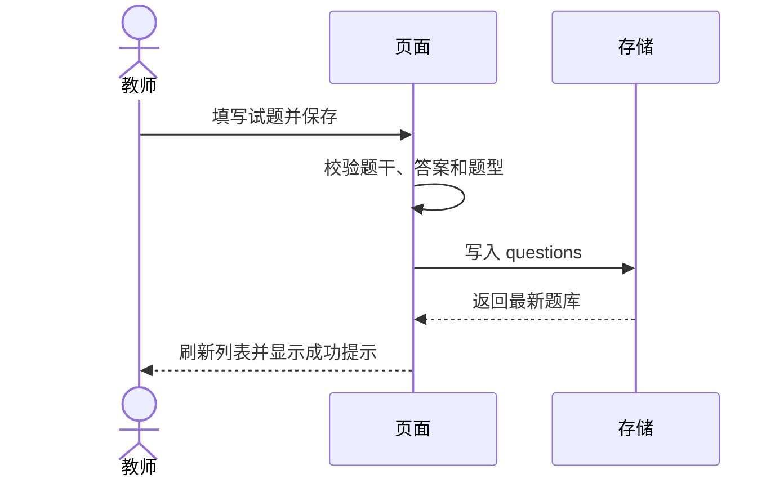
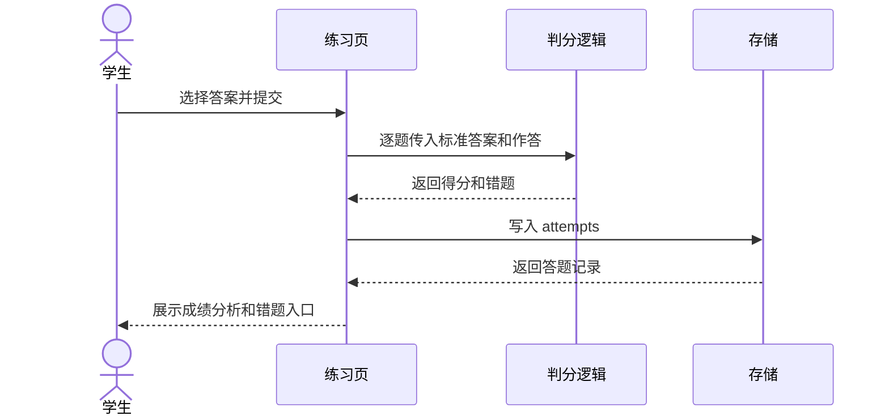

# 题库管理系统设计文档

## 1 设计目标

设计以“可演示、低依赖、可扩展”为目标，在不安装第三方包的情况下完成课程设计系统。当前实现是浏览器单页应用，使用 Node.js 内置 HTTP 服务提供静态文件，使用浏览器本地存储保存演示数据。

## 2 总体架构

### 2.1 部署结构

| 层次 | 文件或组件 | 职责 |
| --- | --- | --- |
| 表现层 | `index.html`、`styles.css` | 页面入口、布局、响应式样式 |
| 应用层 | `app.js` | 角色菜单、页面渲染、模态表单、组卷和判分 |
| 数据层 | `localStorage` | 保存 users、courses、types、questions、papers、attempts |
| 服务层 | `server.mjs` | 用 Node.js 内置模块提供静态资源 |

真实项目扩展时，可以把数据层替换为 REST API 和关系数据库，保留表现层的页面结构和业务模型。

## 3 模块设计

| 模块 | 主要内容 | 关键页面 |
| --- | --- | --- |
| 身份与权限 | 登录、会话、角色菜单、退出 | 登录页、个人信息 |
| 工作台 | 统计卡片、题库概览、待处理事项 | 工作台 |
| 课程管理 | 课程 CRUD、搜索和状态 | 课程管理 |
| 题型管理 | 题型 CRUD、使用数量、删除约束 | 题型管理 |
| 试题管理 | 多题型表单、筛选、详情和解析 | 试题管理 |
| 试卷管理 | 选择试题、总分计算、发布和撤回 | 试卷管理 |
| 在线练习 | 倒计时、答题、提交和判分 | 在线练习 |
| 学情反馈 | 成绩记录、错题本、课程掌握度 | 成绩分析、错题本 |

## 4 数据设计

### 4.1 存储键

- `zhiti-question-bank-v1`：业务数据。
- `zhiti-current-user-v1`：当前会话用户 ID。

### 4.2 关键完整性规则

1. 试题必须关联课程和题型。
2. 试卷只引用已发布试题；删除试题时同步移除试卷引用。
3. 题型被试题引用时不能删除。
4. 学生只可查看已发布试卷。
5. 答题记录关联一个学生和一份试卷，分数由题目答案计算得到。

## 5 页面与交互设计

### 5.1 管理端

管理端使用左侧导航和主内容区布局。工作台通过统计卡片呈现题库总量、已发布试卷、考试人次和平均分；列表页面统一使用搜索、筛选、表格和模态表单；删除行为使用二次确认。

### 5.2 学生端

学生端隐藏管理类菜单，仅保留在线练习、成绩分析和错题本。在线答题页按题目编号展示试题，顶部提供倒计时，提交后跳转成绩分析。

### 5.3 响应式设计

宽屏显示固定侧栏；窄屏将侧栏收起为抽屉，通过顶部菜单按钮展开。表格支持横向滚动，表单和试卷卡片在窄屏下改为单列。

## 6 关键流程设计

## 7 可扩展方向

1. 使用后端数据库替换本地存储，增加教师数据隔离和并发控制。
2. 增加按题型和难度的随机组卷策略。
3. 增加图片题、附件题和复杂公式题。
4. 接入校园统一身份认证和邮件/站内消息。
5. 引入真实的简答题人工阅卷和评分记录。
